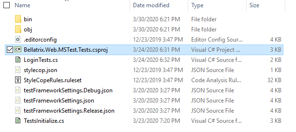

Overview
--------
BELLATRIX is not a single thing it contains multiple framework libraries, extensions and tools. The tool is built to be cross-platform, however some of the features can be used under Windows since they are written for Visual Studio.

Simple Installation
------------------
1. Download the BELLATRIX projects zip file from the green button Code.
2. Unzip it. The projects are grouped by technology: web, desktop, mobile, API, load testing


3. Open the project based on the test framework you prefer: MSTest or NUnit.


4. Click on the csproj file.



5. Run the sample tests.
6. You can try to write a simple test yourself.
7. For an in-depth revision of all framework features you can open the getting started projects.

- [**Starter Kits**](how-to-use-starter-kits.md)

Running Tests through CLI
--------------------------
 To execute your tests via command line in Continues Integration (CI), you can use the native .NET Core test runner.
1. Navigate to the folder of your test project.
2. Open the CMD there.
3. Execute the following command:

```
dotnet test
```
For applying filters and other more advanced configuration check the official documentation [https://docs.microsoft.com/en-us/dotnet/core/tools/dotnet-test](https://docs.microsoft.com/en-us/dotnet/core/tools/dotnet-test "dotnet test") and [https://docs.microsoft.com/en-us/dotnet/core/tools/dotnet-vstest](https://docs.microsoft.com/en-us/dotnet/core/tools/dotnet-vstest "dotnet vstest").

Both MSTest and NUnit are supported.
