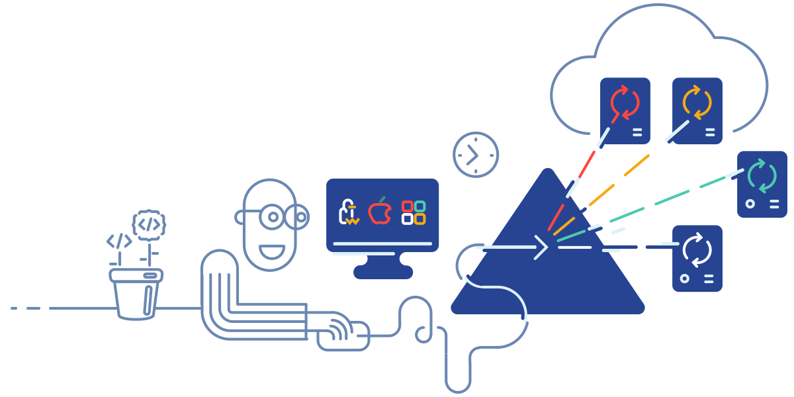

BELLATRIX Test Automation Framework 
---------------------------------------------------------

BELLATRIX is web, desktop, mobile and API test automation framework. It is cross-platform, easily customizable and extensible, increasing tests’ reliability.

In order to deliver seamless user experience, we keep the same structure in the documentation and our Ready-To-Go solution (starting kit).
This documentation will walk you through the process [**installation**](https://docs.bellatrix.solutions/general-information/installation-windows/), explanation How to Use [**Starter Kits**](https://docs.bellatrix.solutions/general-information/how-to-use-starter-kits/). Go to the process of creating your first web desktop or API automated test case. When you are ready you can dive into advanced topics like extendability responsive layouts testing.

There are two approaches to write BELLATRIX automated tests.
- Standard that your tests are in the form of unit tests and you call the BELLATRIX libraries like code
- BDD - the test cases are defined as SpecFlow scenarios in feature files. Some of the logic is called as SpecFlow steps. For advanced framework logic, you can create custom coded SpecFlow steps where you call the BELLATRIX APIs.

Note: [SpecFlow](https://specflow.org/) is a tool binding business requirements to .NET Code or [Cucumber](https://cucumber.io/docs/guides/overview/) for .NET.
Behavioral Driven Development (BDD) is a software development approach that has evolved from TDD (Test Driven Development). It differs by being written in a shared language, which improves communication between tech and non-tech teams and stakeholders. In both development approaches, tests are written ahead of the code, but in BDD, tests are more user-focused and based on the system’s behavior.

Meissa Test Runner
------------------

Our cross-platform distributed test runner that executes tests in parallel, time balanced. Build to extend BELLATRIX capabilities by providing Faster Deployments. Free for the community, find out more [**here**](https://meissarunner.com/)
