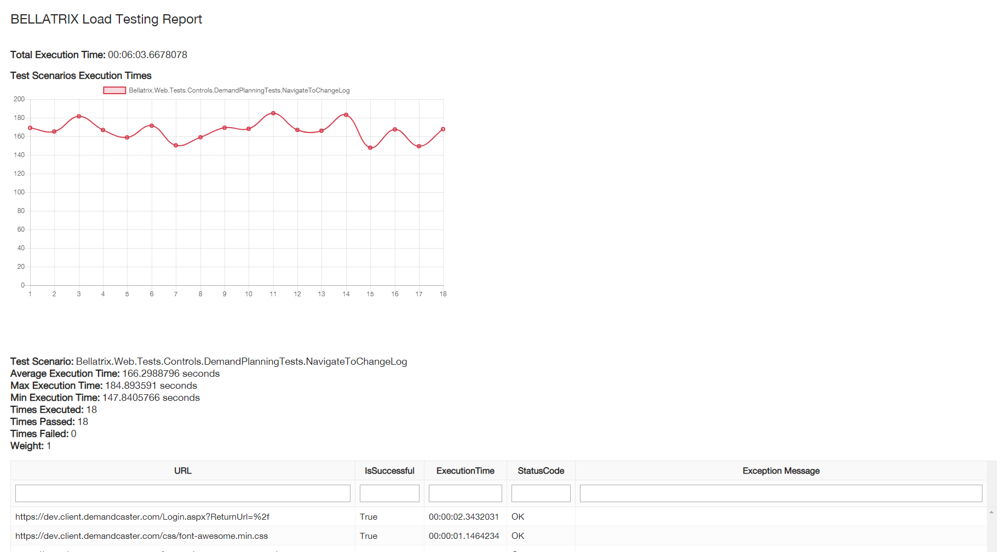

Overview
-------
Load testing is a kind of performance testing which determines a system's performance under real-life load conditions. This testing helps to determine how the application behaves when multiple users access it simultaneously. This testing usually identifies the maximum operating capacity of an application. BELLATRIX offers a module for making load tests.

Example
-------
```csharp
[TestClass]
public class DemandPlanningTests : LoadTest
{
    [TestMethod]
    public void NavigateToDemandPlanning()
    {
        LoadTestEngine.Settings.LoadTestType = LoadTestType.ExecuteForTime;
        LoadTestEngine.Settings.MixtureMode = MixtureMode.Equal;
        LoadTestEngine.Settings.NumberOfProcesses = 1;
        LoadTestEngine.Settings.PauseBetweenStartSeconds = 0;
        LoadTestEngine.Settings.SecondsToBeExecuted = 60;
        LoadTestEngine.Settings.ShouldExecuteRecordedRequestPauses = true;
        LoadTestEngine.Settings.IgnoreUrlRequestsPatterns.Add(".*theming.js.*");
        LoadTestEngine.Assertions.AssertAllRequestStatusesAreSuccessful();
        LoadTestEngine.Assertions.AssertAllRecordedEnsureAssertions();

        LoadTestEngine.Execute("loadTestResults.html");
    }
}
```
The library offers various configurations such as the number of execution processes, total time of execution, regex filters for filtering some requests, specifying what type of assertions to be made and so on. You can change how the engine balances your test scenarios. It can execute them equal times or run some of them more often.
To run your tests you need to set few things in the **testFrameworkSettings.json** file.
```json
{
  "loadTestingSettings": {
    "isEnabled": "true",
    "defaultHost": "demos.bellatrix.solutions",
    "shouldRecordHostRequestsOnly": "true",
    "requestsFileLocation":"AssemblyFolder\\LoadTestsRequests\\",
    "certificatePaths": [ "AssemblyFolder\\bellatrix.cer" ],
    "ignoreUrlRequestsPatterns": [ ".*wp-admin.*" ]
  },
  "apiSettings": {
      "baseUrl": "http://demos.bellatrix.solutions",
      "clientTimeoutSeconds": "30",
      "maxRetryAttempts": "0",
      "pauseBetweenFailures": "0",
      "timeUnit": "1"
  },
  "logging": {
    "isEnabled": "true",
    "isConsoleLoggingEnabled": "true",
    "isDebugLoggingEnabled": "true",
    "isEventLoggingEnabled": "false",
    "isFileLoggingEnabled": "true",
    "outputTemplate": "[{Timestamp:HH:mm:ss}] {Message:lj}{NewLine}",
    "addUrlToBddLogging": "true"
  }
}
```
Since we use BELLATRIX API for making the web requests, you need to configure the **apiSettings** section. 
In the loadTestingSettings section, it is essential to set the requestsFileLocation variable pointing where your tests records are located. In the next part, we will go through other parameters and how to create these 'tests records' (records of your existing BELLATRIX web tests).
**Settings**
- **LoadTestType** - controls whether the tests is executed for a specified time or number of times
- **MixtureMode** - controls how the tests are ballanced. In equal mode all tests are balanced equally. If you use the Weight mode, you can specify weights for each particular test scenario and based on them the tests will be balanced between the load test users (load test processes).
- **ShouldExecuteRecordedRequestPauses** - will simulate exactly the times between the recorded requests
- **NumberOfProcesses** - the number of load test users
- **PauseBetweenStartSeconds** - artificial pause before starting a new test scenario
- **TimesToBeExecuted** - times to be executed if you use the **LoadTestType = NumberOfTimes**
- **SecondsToBeExecuted** - how long the tests will go on if you use **LoadTestType = ExecuteForTime**
- **IgnoreUrlRequestsPatterns** - list of regex expressions which are used to filter the requests
- **TestScenariosNotToBeExecutedPatterns** - list of regex expressions to specify which tests not to be executed. If you have add expressions to **TestScenariosToBeExecutedPatterns** this one is ignored.
- **TestScenariosToBeExecutedPatterns** - list of regex expressions to specify which tests to be performed.
- **TestScenariosWeights** - specify the weights for particular tests if you use **MixtureMode = Weight**

Reuse Existing BELLATRIX Web Tests
------------
A big problem of most load testing solutions is that your tests get outdated quite fast with each small update of your website. The usual fix is to rewrite all existing tests. To solve this problem, we integrated some of BELLATRIX most powerful features so that each time your web tests are executed, they will update your load tests as well.
To mark a web test to be reused for load testing you only need to mark it with the **@loadTest** attribute and turn on the web requests recording.
```csharp
Feature: Navigate to BELLATRIX Online Rocket Shop
	To purchase a new rocket
	As a Nuclear Engineer 
	I want to be able to buy a new rocket.

Background: 
Given Add Custom Driver Capabilities
And I use Chrome browser on Windows
And I restart the browser every time
And I open browser

@loadTest
Scenario: Successfully By Product 28 with Coupon
	
	When I navigate to home page
	And I filter products by popularity
	And I add product by ID = 28
	And I click view cart button
	And I apply coupon happybirthday
	And I update product 1 quantity to 2
	Then I assert total price is equal to 114.00
    When I click proceed to checkout button
    And I set first name = In
    And I set last name = Deepthought
    And I set company = Automate The Planet Ltd.
    And I set country = Bulgaria
    And I set address 1 = bul. Yerusalim 5
    And I set address 2 = bul. Yerusalim 6
    And I set city = Sofia
    And I set state = Sofia-Grad
    And I set zip = 1000
    And I set phone = +00359894646464
    And I set email = info@bellatrix.solutions
    And I add  order comments = cool product
    And I check payments button
```
You need to turn-on the load testing module in the **testFrameworkSettings.json** file.
```json
  "loadTestingSettings": {
    "isEnabled": "true",
    "defaultHost": "demos.bellatrix.solutions",
    "shouldRecordHostRequestsOnly": "true",
    "requestsFileLocation": "AssemblyFolder\\LoadTestsRequests\\",
    "ignoreUrlRequestsPatterns": [ ".*wp-admin.*" ]
  },
  "webProxySettings": {
    "isEnabled": "true",
    "pathToSslCertificate": "bellatrix.cer"
  },
```
Moreover, you need to make sure that the web proxy is enabled as well since we use it to record the web requests.
Through **defaultHost** and **shouldRecordHostRequestsOnly** variables you can instruct the framework to record only the requests of the specified host and ignore all 3rd party services ones. Sometimes you want to ignore some requests to your host as well. You can specify a series of regex patterns which will be used to filter the requests.

Advanced Load Test Assertions
-----------------------------

One of the neatest features of all is that all of your web assertions will be recorded too and will be performed in your load test. The load test library will smartly decide which response contains the HTML of the page and based on the specified locators in your test will perform the assertion such as element is visible, some text is displayed or disabled.
To use it you only need to set up the load test to make these kind of assertions.
```csharp
LoadTestEngine.Assertions.AssertAllRecordedEnsureAssertions();
```
The load testing module also offers automatic check whether all of the requests were successful or not.
```csharp
LoadTestEngine.Assertions.AssertAllRequestStatusesAreSuccessful();
```

Informative Load Testing Test Report
------------------------------------

After the load test is executed the tool generates an informative HTML report.



Through the various grids, you can analyze what happened in the test. Locate the slowest web requests or the ones that have errors. Moreover, you can compare the different test scenarios.
